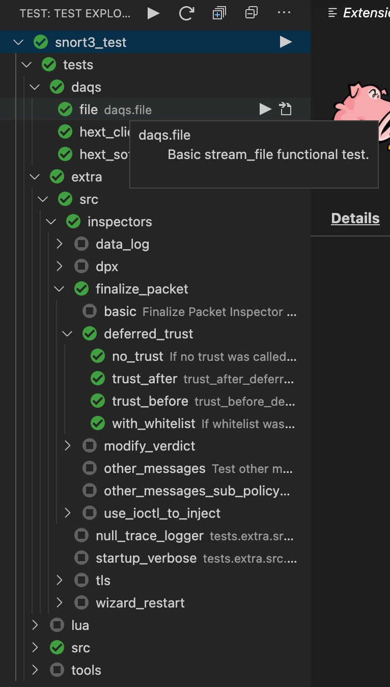

# Snort3 Test Explorer for Visual Studio Code

Snort3 Test Explorer is a visual studio code extension that lets you run snort3 tests in the Sidebar of Visual Studio Code. This extention will activate when there is a snort3_test folder open in the workspace and automatically list all the tests available in the [Test Explorer](https://marketplace.visualstudio.com/items?itemName=hbenl.vscode-test-explorer) side bar.

## Setup

* install the [Snort3 Test Explorer](https://marketplace.visualstudio.com/items?itemName=diptopandit.snort3-test-adapter) extension
* open extension settings 
* set sf_prefix_snort3 to snort install path
* set snort_srcpath to snort source code path
* set dependencies to dependencies (libdaq, abcip, cpputest etc.) installation path

You should now see a tree view of all the tests in the side panel:

